# iOS Voicemail Converter - Architecture Diagrams

**Version:** 1.0.0
**Date:** 2025-11-08

This document provides visual representations of the system architecture from multiple perspectives.

---

## Table of Contents

1. [System Context Diagram](#1-system-context-diagram)
2. [High-Level Architecture](#2-high-level-architecture)
3. [Component Architecture](#3-component-architecture)
4. [Data Flow Diagram](#4-data-flow-diagram)
5. [Class Structure](#5-class-structure)
6. [Sequence Diagrams](#6-sequence-diagrams)
7. [Deployment View](#7-deployment-view)

---

## 1. System Context Diagram

Shows how the system interacts with external entities.

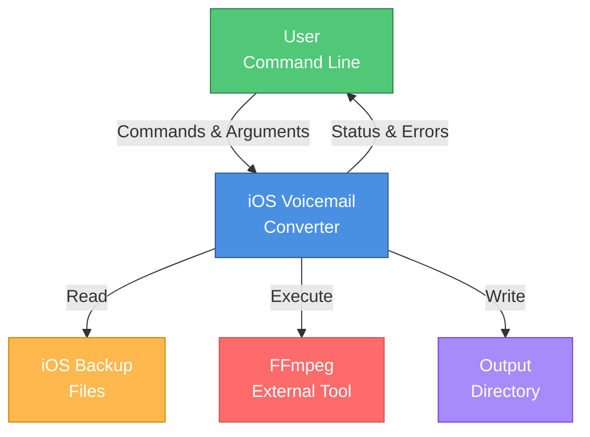

**External Dependencies:**
- **User**: Provides command-line arguments and monitors progress
- **iOS Backup Files**: Read-only access to iTunes/Finder backups
- **FFmpeg**: External process for audio conversion
- **Output Directory**: Filesystem location for converted files

---

## 2. High-Level Architecture

Three-tier architecture showing logical layers.

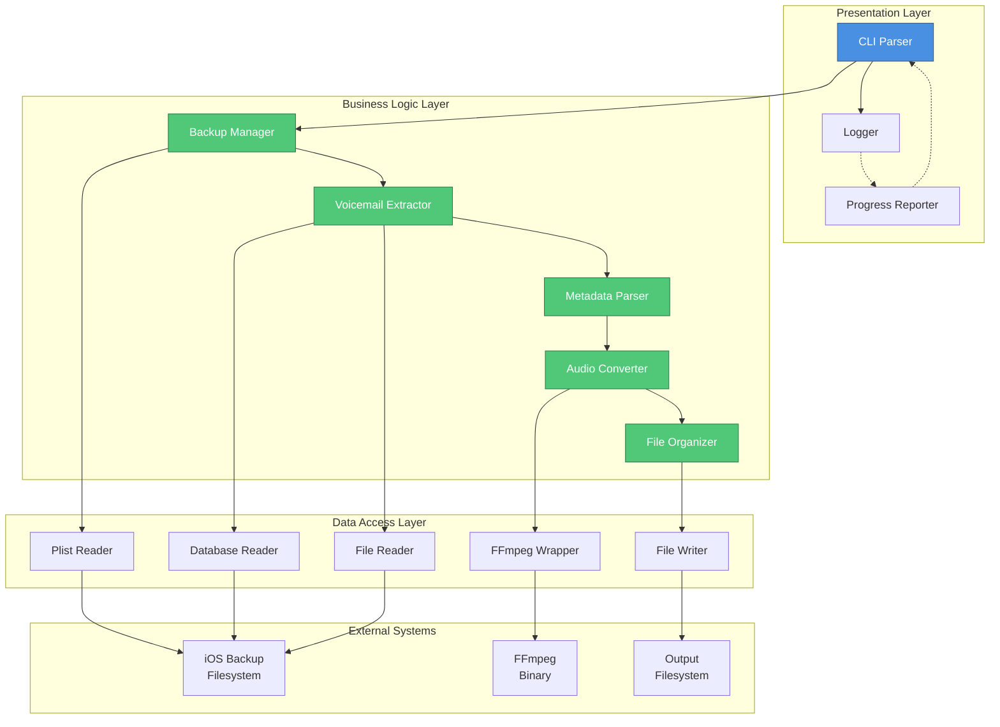

---

## 3. Component Architecture

Detailed component diagram showing modules and their interactions.

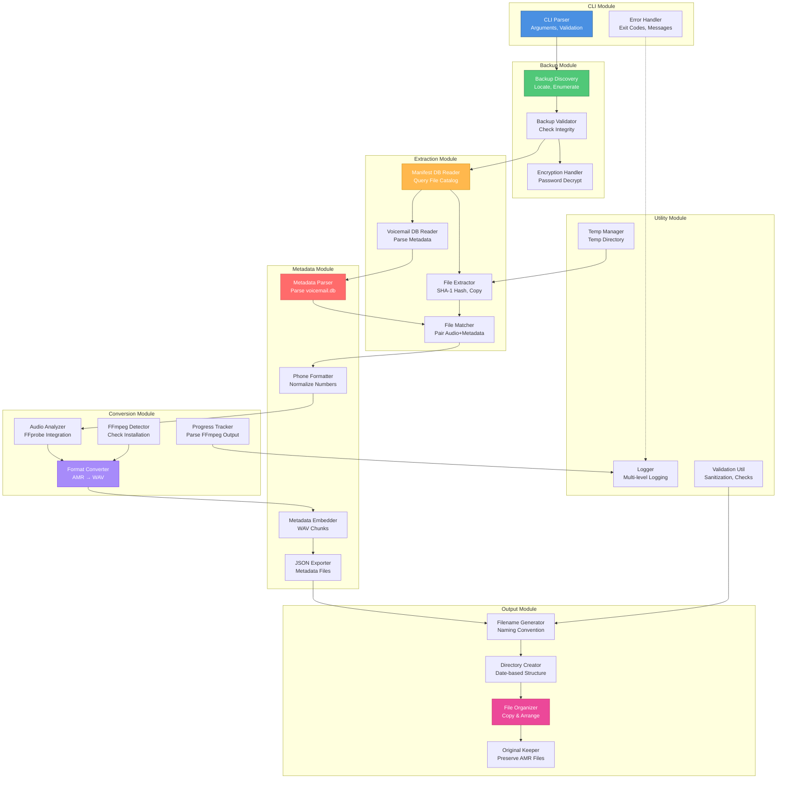

---

## 4. Data Flow Diagram

Shows how data moves through the system.

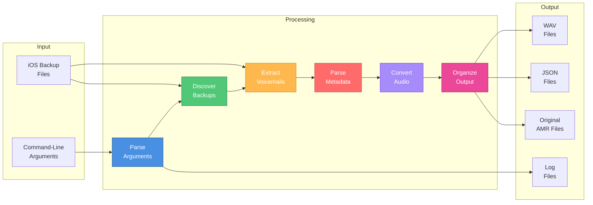

**Data Transformations:**

1. **Command Args** → **Config Object** (validation, defaults)
2. **Backup Directory** → **BackupInfo Object** (discovery, parsing)
3. **Manifest.db** → **File Hash List** (SQLite query)
4. **Hashed Files** → **AMR Audio Files** (extraction to temp)
5. **voicemail.db** → **VoicemailMetadata Objects** (parsing)
6. **AMR Files + Metadata** → **VoicemailFile Objects** (pairing)
7. **AMR Audio** → **WAV Audio** (FFmpeg conversion)
8. **VoicemailFile** → **Structured Output** (organization)

---

## 5. Class Structure

High-level class diagram showing key classes and relationships.

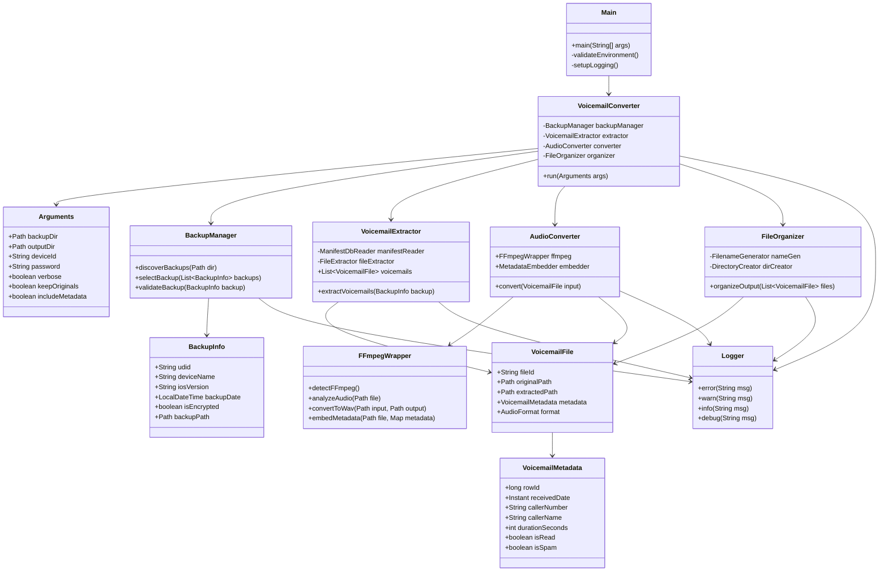

---

## 6. Sequence Diagrams

### 6.1 Main Execution Flow

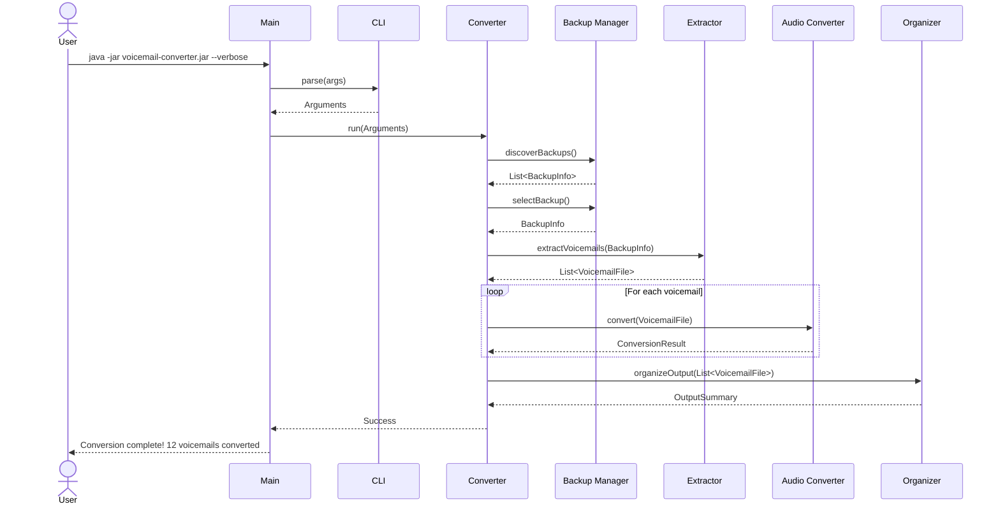

### 6.2 Backup Discovery Sequence

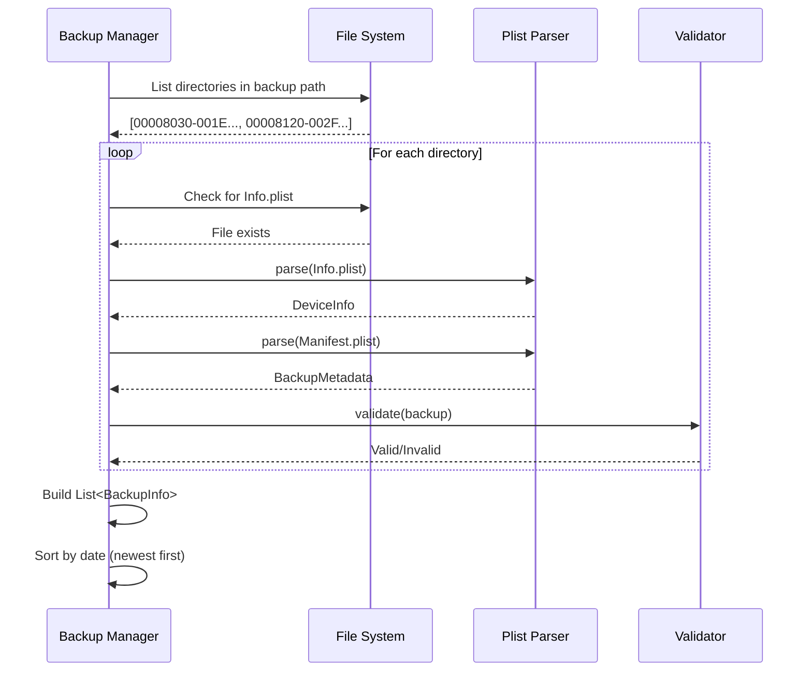

### 6.3 Voicemail Extraction Sequence

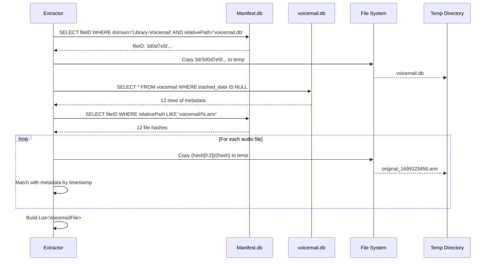

### 6.4 Audio Conversion Sequence

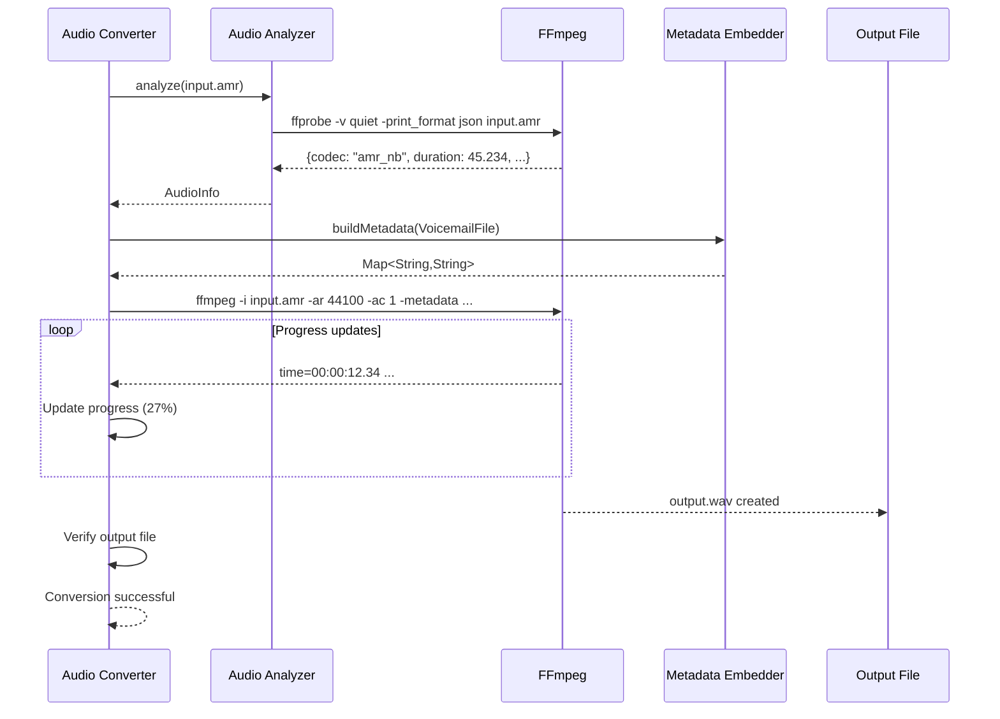

### 6.5 File Organization Sequence

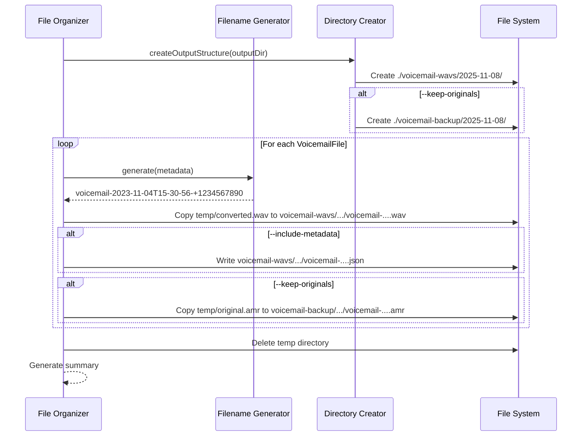

---

## 7. Deployment View

Shows runtime environment and dependencies.

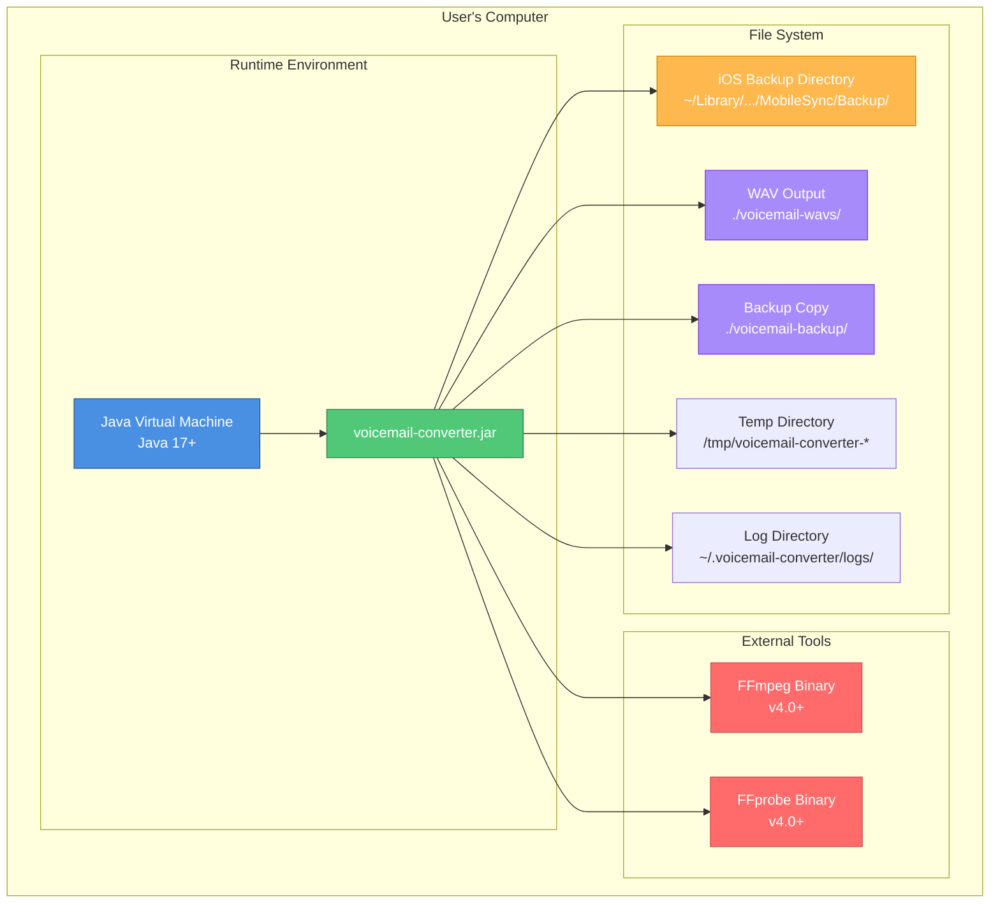

### Runtime Requirements

| Component | Version | Purpose |
|-----------|---------|---------|
| Java | 17+ | Runtime environment |
| FFmpeg | 4.0+ | Audio conversion |
| ffprobe | 4.0+ | Audio analysis |
| SQLite JDBC | 3.40+ | Database access |

### File System Interactions

```
Read Operations:
  ✓ iOS Backup directory (read-only)
  ✓ Info.plist, Manifest.plist
  ✓ Manifest.db (SQLite)
  ✓ voicemail.db (SQLite)
  ✓ Hashed backup files

Write Operations:
  ✓ Temp directory (create, write, delete)
  ✓ Output directory (create, write)
  ✓ Log directory (create, append)

No Modifications:
  ✗ iOS Backup files (never modified)
```

---

## 8. Error Handling Flow

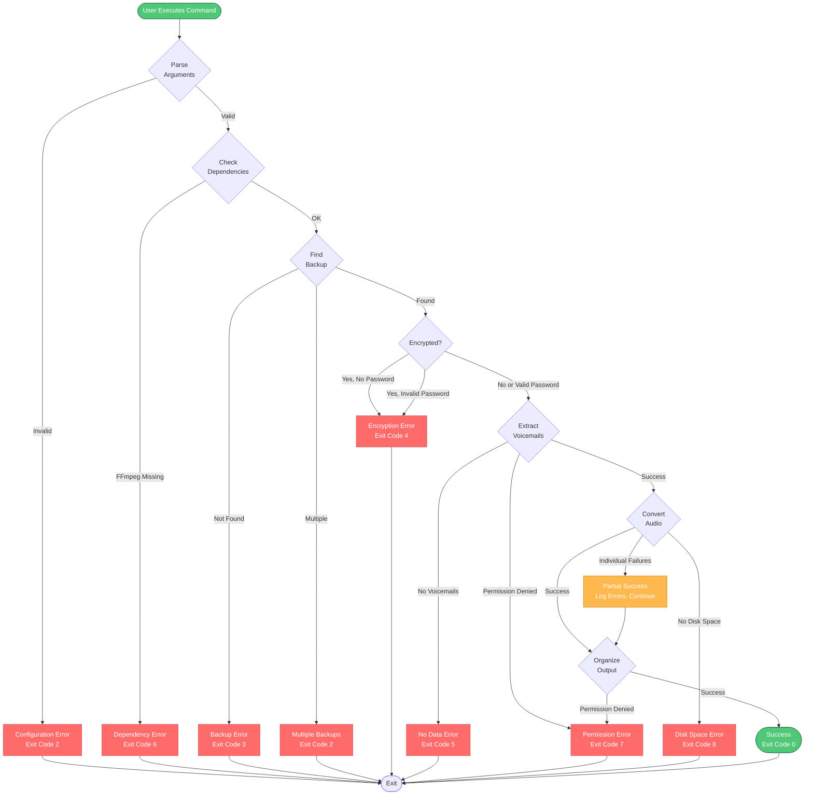

---

## 9. Module Dependency Graph

Shows compile-time dependencies between modules.

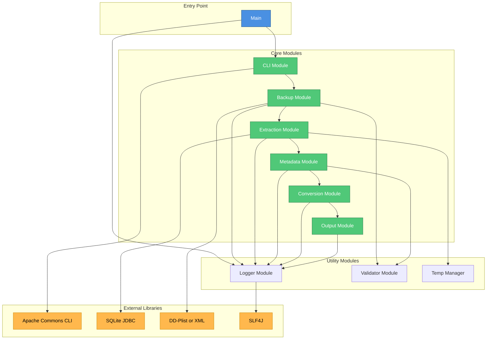

---

## 10. Package Structure

Detailed view of Java package organization.

```
com.voicemail
│
├── Main.java                           # Entry point
│
├── cli/                                # CLI Module
│   ├── CLIParser.java                  # Argument parsing
│   ├── Arguments.java                  # Config object
│   └── HelpFormatter.java              # Usage display
│
├── backup/                             # Backup Module
│   ├── BackupDiscovery.java            # Locate backups
│   ├── BackupInfo.java                 # Backup metadata
│   ├── BackupValidator.java            # Validation logic
│   ├── PlistParser.java                # Parse .plist files
│   └── EncryptionHandler.java          # Decrypt backups
│
├── extractor/                          # Extraction Module
│   ├── VoicemailExtractor.java         # Main orchestrator
│   ├── ManifestDbReader.java           # Read Manifest.db
│   ├── VoicemailDbReader.java          # Read voicemail.db
│   ├── FileExtractor.java              # Extract files
│   └── FileMatcher.java                # Match audio+metadata
│
├── metadata/                           # Metadata Module
│   ├── MetadataParser.java             # Parse voicemail.db
│   ├── VoicemailMetadata.java          # Metadata object
│   ├── PhoneNumberFormatter.java       # Normalize phones
│   ├── MetadataEmbedder.java           # Embed in WAV
│   └── JSONExporter.java               # Export to JSON
│
├── converter/                          # Conversion Module
│   ├── AudioConverter.java             # Main orchestrator
│   ├── FFmpegWrapper.java              # FFmpeg integration
│   ├── FFmpegDetector.java             # Check installation
│   ├── AudioAnalyzer.java              # FFprobe wrapper
│   ├── AudioFormat.java                # Format enum
│   ├── ConversionResult.java           # Result object
│   └── ProgressTracker.java            # Track progress
│
├── output/                             # Output Module
│   ├── FileOrganizer.java              # Main orchestrator
│   ├── FilenameGenerator.java          # Generate names
│   ├── DirectoryCreator.java           # Create structure
│   └── OriginalFileKeeper.java         # Copy originals
│
├── util/                               # Utility Module
│   ├── Logger.java                     # Logging facade
│   ├── TempDirectoryManager.java       # Temp file mgmt
│   ├── ValidationUtil.java             # Validation helpers
│   └── FileSystemUtil.java             # FS operations
│
└── exception/                          # Exception Module
    ├── VoicemailConverterException.java
    ├── ConfigurationException.java
    ├── DependencyException.java
    ├── BackupException.java
    ├── EncryptionException.java
    ├── PermissionException.java
    └── InsufficientStorageException.java
```

---

## Design Patterns Used

### 1. **Facade Pattern**
- `VoicemailConverter` provides simplified interface to complex subsystems
- Hides complexity of backup discovery, extraction, conversion

### 2. **Strategy Pattern**
- Different conversion strategies (WAV, MP3, FLAC in future)
- Different metadata embedding strategies (WAV chunks vs JSON)

### 3. **Builder Pattern**
- `Arguments` object built from CLI parameters
- Complex FFmpeg command construction

### 4. **Template Method Pattern**
- Base conversion flow with hooks for format-specific operations
- Error handling template with specific implementations

### 5. **Factory Pattern**
- Create appropriate metadata parser based on iOS version
- Create format-specific converters

### 6. **Observer Pattern**
- Progress updates during conversion
- Logging across all components

### 7. **Command Pattern**
- Encapsulate FFmpeg invocations as command objects
- Easier to test, retry, and log

---

## Performance Considerations

### 1. **Parallel Processing**
```
Sequential:  12 files × 2s = 24s
Parallel (4): 12 files / 4 × 2s = 6s

Strategy: ThreadPoolExecutor with 4 threads
```

### 2. **Memory Management**
```
- Stream large files instead of loading into memory
- Close database connections promptly
- Clean up temp files incrementally
```

### 3. **Disk I/O Optimization**
```
- Batch file operations where possible
- Use buffered streams
- Minimize temp file writes
```

---

## Security Considerations

### 1. **Backup Password Handling**
```
✓ Never log passwords
✓ Clear from memory after use
✓ Warn about command-line visibility
```

### 2. **Filesystem Security**
```
✓ Validate all paths (no traversal)
✓ Check permissions before operations
✓ Fail securely (don't expose internals)
```

### 3. **Input Validation**
```
✓ Sanitize all filenames
✓ Validate UDID format
✓ Prevent SQL injection (use prepared statements)
```

---

## Rendering These Diagrams

### GitHub / GitLab
These Mermaid diagrams will render automatically when viewing this file on GitHub or GitLab.

### VSCode
Install the "Markdown Preview Mermaid Support" extension.

### Command Line
```bash
# Install mermaid-cli
npm install -g @mermaid-js/mermaid-cli

# Render to PNG
mmdc -i ARCHITECTURE.md -o architecture.png

# Render to SVG
mmdc -i ARCHITECTURE.md -o architecture.svg
```

### Online Tools
- [Mermaid Live Editor](https://mermaid.live/)
- Copy/paste diagrams for interactive editing

---

**End of Architecture Documentation**
